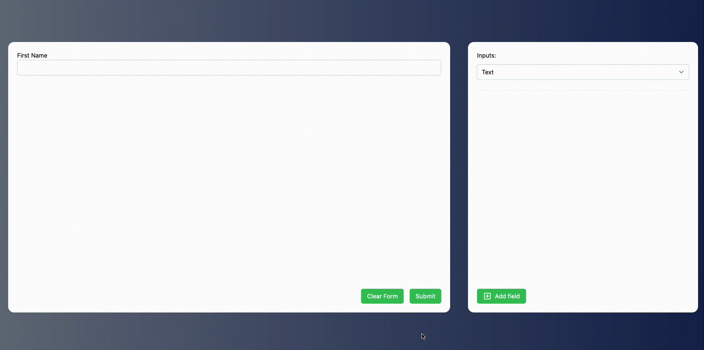

# Landbell Challenge

This is a VueJs challenge provided by LandBell in order to test programming 
skill and problem-solving abilities 

## Overview

The challenge is to developer a Form builder, which has 2 panels, the right 
one, is the field to choose in order to create a form (text, select, date, 
etc), the left one is the form whith all fields chose from the other panel

## Requirements (Bussiness Rules)

- To add a field, the user must first choose the field type and then the
  properties (label, field name, options, etc);
- When the user clicks on Add Field, it should reflect on the form on the left
  side and reset the setting on the right side;
- The form must persist when the user refreshes the page or leaves the page;
- When clicking submit, log to the console an object of the form, the key being
  the "Field Name" and the value the user input (output example below);


## ScreenShot



## Project Setup

```sh
pnpm install
```

### Compile and Hot-Reload for Development

```sh
pnpm dev
```

### Type-Check, Compile and Minify for Production

```sh
pnpm build
```

### Run End-to-End Tests with [Cypress](https://www.cypress.io/)

```sh
pnpm test:e2e:dev
```

This runs the end-to-end tests against the Vite development server.
It is much faster than the production build.

But it's still recommended to test the production build with `test:e2e` before deploying (e.g. in CI environments):

```sh
pnpm build
pnpm test:e2e
```
